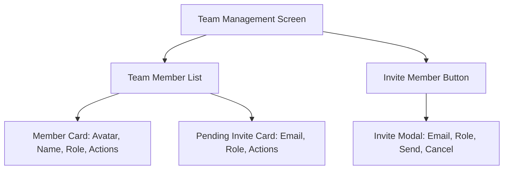

# The Props Bible - Product Requirements Document (PRD)

## 1. Product Overview

### 1.1 Product Vision
The Props Bible is a comprehensive mobile and web application designed to serve as the ultimate digital companion for theater production professionals, providing real-time access to props management, tracking, and coordination tools.

### 1.2 Target Audience
- Props Masters
- Props Assistants
- Production Designers
- Art Department Coordinators
- Set Decorators
- stage managers 
- assistant stage managers 

## 2. Problem Statement
Production teams face significant challenges in managing, tracking, and coordinating props across complex theater. Current solutions are often fragmented, manual, or lack real-time collaboration capabilities.

## 3. Product Features and Requirements

### 3.1 Core Features
- user can sigin in with google or standard email sigin up 
- profile details form google


#### 3.1.1 Props Management
- Digital inventory system for all props
  -- stage managers use The Vision API from google to help identify objects for title suggestgion 
  -ai chatbot to help fill in the add a new prop form using speach to text

- Categorization and tagging system
- Detailed prop specifications including:
  - Dimensions
  - Materials
  - Historical period
  - Condition
  - Location
  - Availability status
- Photo documentation with multiple angles
-digital assets for props
- Barcode/QR code integration for quick scanning
####3.1.2 pdf genarator with the option for the user to select the information that is shown
- select portrait or lanscape
- select the types of data displayed
- preview the pdf


#### 3.1.2 Pack List and Labels Management
- Pack List Features
  - Dynamic pack list generation by show/scene
  - Customizable packing categories and groups
  - Priority-based packing sequences
  - Multiple pack list templates
  - Quick list cloning for similar shows
  - Real-time packing progress tracking
- Smart Label System
  - Automated QR code generation for props and containers
  - Custom label sizes and formats
  - Batch label printing support
  - Mobile-friendly QR scanning
  - Direct app deep-linking from QR codes
  - Weather-resistant label options
  - Color-coding system for quick identification
- Container Management
  - Container inventory tracking
  - Nested container support
  - Container capacity optimization
  - Weight distribution calculation
  - Loading/unloading sequence planning

#### 3.1.3 Prop Lifecycle Management
- Acquisition Phase
  - Purchase/rental/creation tracking
  - Vendor information
  - Cost history
  - Acquisition date
  - Warranty information
- Active Use Phase
  - Usage history by show
  - Maintenance schedule
  - Repair records
  - Location tracking
  - Check-in/check-out system
  - Condition updates
- Maintenance Management
  - Scheduled maintenance alerts
  - Repair history
  - Cost of maintenance
  - Maintenance procedures documentation
  - Service provider contacts
- Retirement Phase
  - Depreciation tracking
  - Disposal/sale documentation
  - Archive information
  - Historical usage data
  - Replacement recommendations
- Analytics and Reporting
  - Lifecycle cost analysis
  - Usage statistics
  - Maintenance ROI
  - Prop reliability metrics
  - Lifecycle prediction models

#### 3.1.4 Scene Management
- Scene-by-scene prop requirements
- Digital breakdowns
- Props placement tracking
- Continuity management
- Timeline integration with production schedule

#### 3.1.5 Collaboration Tools
- Real-time updates and notifications:
  - Centralized notification feed on the home page/dashboard.
  - Alerts for:
    - New prop requests or requests for information.
    - Changes to prop lifecycle statuses (e.g., 'Needs Repair', 'Ready for Show', 'Returned to Storage').
    - Requests from other team members (e.g., task assignments, collaboration invites, comments needing attention).
    - Upcoming deadlines or important dates related to props or tasks.
  - Customizable notification preferences (e.g., by type, by show, push notifications, email digests).
  - In-app indicators for unread notifications.
- Team member assignment and tracking
- Comment and discussion threads on specific props
- Shared calendars and deadlines
- Permission-based access control

#### 3.1.6 Budget Tracking for set roles
- Props acquisition costs
- Rental tracking and returns
- Budget allocation by department/scene
- Purchase order management
- Vendor management

#### 3.1.7 Department Task Management
- Department Structure
  - Customizable department hierarchy
  - Role-based task assignment
  - Department-specific dashboards
  - Inter-department dependencies tracking

- Task Management Features
  - Department-specific TODO lists
  - Priority levels (Urgent, High, Medium, Low)
  - Due date tracking
  - Task dependencies
  - Progress tracking
  - Task templates for common workflows

- Department Categories
  - Props Department
    - Prop acquisition tasks
    - Maintenance schedules
    - Repair assignments
    - Inventory checks
    - Show-specific prop preparations
  - Stage Management
    - Rehearsal preparations
    - Show call tasks
    - Safety checks
    - Production meeting notes
    - Performance reports

- Task Collaboration
  - Cross-department task visibility
  - Task delegation capabilities
  - Group task assignments
  - Task commenting and discussion
  - File attachments for tasks
  - Task completion verification

- Notifications and Reminders
  - Customizable alert settings
  - Due date reminders
  - Task assignment notifications
  - Priority change alerts
  - Completion notifications
  - Daily/Weekly task digests

- Reporting and Analytics
  - Department efficiency metrics
  - Task completion rates
  - Overdue task tracking
  - Resource allocation analysis
  - Workload distribution
  - Bottleneck identification

#### 3.1.8 Show Management
- Show/Production Details 
  -possible API lookup for show details, dates and venues
  - Show title and description
  - Production company information
  - Season/Run information
  - Show categories and tags
- Venue Management  
  -possible API lookup venue dates and detais
  - Multiple venue support
  - Venue details (name, capacity, contact info, etc.)
  - Venue address stored as a structured Address object (Street, City, Postal Code, Country, etc.)
  - Stage/space specifications
  - Technical facilities available
  - Loading dock and storage information
- Rehearsal Space Management
  - Array of structured Address objects for rehearsal locations stored within the Show data.
- Storage Location Management
  - Array of structured Address objects for storage locations stored within the Show data.
- Personnel Management 
  -possible API lookup of key personell of the show
  - Key production team members
  - Contact information
  - Role assignments
  - Availability tracking
  - Access permissions by role
- Schedule Management
  - Production calendar
  - Rehearsal schedules
  - Performance dates and times
  - Load-in/Load-out scheduling
  - Technical rehearsal timing
- Document Management
  - Production contracts
  - Insurance documents
  - Technical riders
  - Safety protocols
  - Emergency procedures
- Reports Generation
  - Show statistics
  - Attendance tracking
  - Performance reports
  - Incident reports
  - Budget vs. actual spending

#### 3.1.9 Address Management & Selection
- Centralized Address Handling:
  - Show-specific addresses (Venues, Rehearsal Spaces, Storage Locations) are stored within the Show data.
  - User-specific addresses (Saved Sender, Saved Delivery) are stored within the User Profile.
- Reusable Address Selection Modal:
  - A common modal component will be used wherever an address needs to be selected or added (e.g., Packing Labels, Show Setup).
  - The modal will display available addresses grouped by source (Show-related, User Profile Saved).
  - Users can select an existing address or add a new address via the modal.
  - Logic for saving newly added addresses (e.g., to User Profile, to Show data) will be configurable within the modal context.
  - UK Address Validation (using postcodes.io) can be triggered within the modal for new addresses.

### 3.2 Mobile-Specific Requirements (Android)

#### 3.2.1 Technical Requirements
- Minimum Android version: Android 8.0 (API level 26)
- Offline functionality for essential features
- Camera integration for prop documentation
- Barcode/QR code scanning capability

- Push notifications
- Secure local storage
- Cloud sync when online

#####3.2.1.1 prop finder
- allow users to quickly scan a qr code group of qr codes until you identfy the correct box with the prop
- find it in a group photo of all the boxes
- show the box title
#### 3.2.2 User Interface
- Material Design 3 implementation
- Dark/Light mode support
- Responsive layouts for various screen sizes
- Touch-optimized interfaces
- Gesture controls for common actions
- Quick access toolbar for frequent actions

#### 3.2.3 Performance Requirements
- App size < 100MB
- Launch time < 3 seconds
- Image loading time < 2 seconds
- Smooth scrolling (60 fps)
- Battery efficient background operations

### 3.3 Security Requirements
- End-to-end encryption for sensitive data
- Secure authentication (2FA support)
- Role-based access control
- Secure file storage and transmission
- Regular security audits
- Compliance with industry standards

**Firestore Security Rules:**
- Firestore rules must ensure that users can only read/write boards, lists, and tasks where they are the `ownerId` or are included in the `sharedWith` array for a board.
- All board, list, and card/task access must be restricted at the database level to authorized users only.
- Example rule:
  - Allow read/write on `todo_boards/{boardId}` if `request.auth.uid == resource.data.ownerId || request.auth.uid in resource.data.sharedWith`.
  - Allow read/write on `todo_boards/{boardId}/lists/{listId}` and `todo_boards/{boardId}/lists/{listId}/cards/{cardId}` if the user has access to the parent board.

## 4. Success Metrics
- User adoption rate
- Time saved in props management
- Reduction in props-related delays
- User satisfaction scores
- App stability and crash rates
- Feature usage statistics

## 5. Future Considerations
- AI-powered prop suggestions
- AR/VR integration for prop visualization
- Integration with other production software
- Expanded marketplace features
- Advanced analytics and reporting
- Multi-language support

##5.5 add a subsription plan to the app 
- have a wordpress website that sells this app as a saas
-add payment plan. 

##5.6 user profiles
- the users detail
-there app prefarances
-theme choices
  -light and dark themes
-font choices 
  -open dyslexic

## 6. Timeline and Phases

### Phase 1 - Core Foundation 
- User authentication
- Essential mobile features
- Basic offline functionality
- Show management essentials

### Phase 2 - Enhanced Features 
- Advanced collaboration tools
- Complete offline mode
- Budget tracking
- Advanced search and filters

### Phase 3 - Advanced Features 
- AI integration
- Analytics dashboard
- Third-party integrations
- Performance optimizations

### Phase 4 - add ios app
-based on the android app

## 7. Success Criteria
The product will be considered successful when:
- Achieves 80% user satisfaction rate
- Reduces prop management time by 50%
- Maintains 99.9% uptime
- Achieves <1% crash rate
- Processes 1000+ concurrent users smoothly

## 8. Constraints and Dependencies
- React Native framework limitations
- Android platform guidelines
- Network connectivity requirements
- Device storage limitations
- Third-party API dependencies
- Security compliance requirements

## 9. Assumptions
- Users have basic smartphone proficiency
- Stable internet connection available most of the time
- Users require real-time collaboration
- Production companies will provide necessary hardware
- Users will require offline access

## 10. Risks and Mitigation
- Data loss risk: Implement robust backup systems
- Security breaches: Regular security audits
- User adoption: Comprehensive onboarding
- Performance issues: Regular optimization
- Compatibility issues: Extensive testing

---
Note: This PRD is a living document and will be updated as the project evolves and new requirements are identified.

## Clean Project Structure Reference (Top-Level)

Below is a reference tree of the top-level folders and files that should be kept in a clean, production-ready version of this project. Each is briefly explained. This section will be updated as we review each subfolder in detail.

```
project/
  app/                # Main app folder (navigation, screens, features)
  src/                # Source code (components, contexts, services, types, hooks, etc.)
  assets/             # Images, fonts, and other static assets
  public/             # Public assets (web)
  _docs/              # Project documentation
  package.json        # Project dependencies and scripts
  tsconfig.json       # TypeScript configuration
  App.tsx             # Main app entry point
  index.js            # Main web entry point
  README.md           # Project documentation
  yarn.lock           # Dependency lock (if using yarn)
  babel.config.cjs    # Babel build config
  metro.config.cjs    # Metro bundler config
  react-native.config.js # React Native config
  global.css          # Global styles
  tailwind.config.js  # Tailwind CSS config
  postcss.config.js   # PostCSS config
  firebase.json       # Firebase config
  eas.json            # Expo Application Services config
  cors.json           # CORS config
  ...
```

**Explanations:**
- `app/`: Main app logic, navigation, and feature screens.
- `src/`: All source code, organized by feature and concern.
- `assets/`: Static assets like images and fonts.
- `public/`: Public assets for the web build.
- `_docs/`: Project documentation, plans, and reference material.
- `package.json`, `tsconfig.json`, `App.tsx`, `index.js`: Core project files.
- `README.md`: Project documentation.
- `yarn.lock`: Dependency lock file (keep only one lock file).
- `babel.config.cjs`, `metro.config.cjs`, `react-native.config.js`: Build and platform configs.
- `global.css`, `tailwind.config.js`, `postcss.config.js`: Styling configs.
- `firebase.json`, `eas.json`, `cors.json`: Platform/service configs.

*This tree will be updated as we review each subfolder in detail.* 

## Team & Role Management

### Overview
The app supports collaborative management of shows, props, and tasks via a team-based, role-driven access control system.

### Roles
- **god**: Superuser, full access, cannot be removed.
- **props supervisor**: Show admin, can manage team, props, tasks, and define permissions for other roles.
- **stage manager**: Permissions defined by props supervisor.
- **prop maker**: Permissions defined by props supervisor.
- **props supervisor's assistant**: Permissions defined by props supervisor.
- **assistant stage manager**: Permissions defined by props supervisor.

### Permissions
Each role has a set of permissions (see table below). Props supervisor can customize permissions for each user (except god).

| Role                        | Manage Team | Manage Props | Manage Tasks | View All | Assign Tasks | Custom Permissions |
|-----------------------------|:-----------:|:------------:|:------------:|:--------:|:------------:|:------------------:|
| god                         |      ✓      |      ✓       |      ✓       |    ✓     |      ✓       |         ✓          |
| props supervisor            |      ✓      |      ✓       |      ✓       |    ✓     |      ✓       |         ✓          |
| stage manager               |      ?      |      ?       |      ?       |    ?     |      ?       |         ✓          |
| prop maker                  |      ?      |      ?       |      ?       |    ?     |      ?       |         ✓          |
| props supervisor's assistant|      ?      |      ?       |      ?       |    ?     |      ?       |         ✓          |
| assistant stage manager     |      ?      |      ?       |      ?       |    ?     |      ?       |         ✓          |

("?" = defined by props supervisor)

### Team Management
- Invite users by email, assign role.
- Team members can see each other and their roles.
- Props supervisor/god can edit roles or remove users.

### Task & Prop Integration
- Assign tasks to team members.
- Prop detail page shows active tasks/cards under "Maintenance."
- Task cards link to prop and show assignee/status.

### User Lifecycle
- Invitation, onboarding, role change, removal, visibility.

### Security
- All permissions enforced on backend and UI. 

## Team Management: Implementation & Wireframes

### 1. Data Model
- Each show document contains a `team` map: `{ [userId]: role }` (e.g., god, props_supervisor, stage_manager, etc.)
- Invitations are stored in an `invitations` collection with fields: `email`, `showId`, `role`, `invitedBy`, `status`, `createdAt`, `acceptedAt`.

### 2. Firestore Security Rules
- Team membership and roles are enforced using map lookups in Firestore rules.
- Only god/props_supervisor can invite, change roles, or remove users.
- See `_docs/firestore.rules` for full details.

### 3. Backend Logic (Firebase Functions)
- **inviteUserToShow**: Only god/props_supervisor can invite. Creates invitation document.
- **acceptInvitation**: User accepts invite, is added to show team, invitation marked accepted.
- **updateTeamMemberRole**: Only god/props_supervisor can change roles.
- **removeTeamMember**: Only god/props_supervisor can remove users (not god).

### 4. Frontend Integration (React Native/Expo)
- List team members, show roles, allow role change/remove if permitted.
- Invite modal for email/role.
- Show pending invitations with resend/cancel.
- Accept invitation screen for new users.
- Fetch user profiles for display (name, avatar, etc.).

### 5. Error Handling & Edge Cases
- Cannot remove or demote god.
- Prevent duplicate invites.
- Handle expired/accepted invites.
- Show clear error messages for all actions.

### 6. Advanced Features
- Search/filter team members.
- Audit log of team actions (optional).
- Bulk actions for role change/removal.
- Real-time updates with Firestore listeners.

### 7. Figma-Ready Wireframe Spec

**Team Management Screen (Mobile)**

```
-------------------------------------------------
| < Back |           Team Management            |
-------------------------------------------------
| [Avatar]  John Doe         god                |
| [Avatar]  Jane Smith       props_supervisor   | [Change Role ▼] [Remove]
| [Avatar]  Bob Brown        stage_manager      | [Change Role ▼] [Remove]
| [Avatar]  Alice White      invited (pending)  | [Resend] [Cancel]
-------------------------------------------------
| + Invite Member                                 |
-------------------------------------------------
```

**Invite Member Modal**
- Email input
- Role dropdown
- Send Invite button
- Cancel button

**Annotations:**
- "Change Role" is a dropdown for permitted users.
- "Remove" is disabled for god.
- Pending invites are shown with "pending" status and actions.

### 8. Mermaid Diagram: Team Management Flow



---

*This section provides a consolidated reference for your team management system, suitable for handoff to developers or designers, and for use in Figma or other design tools.* 